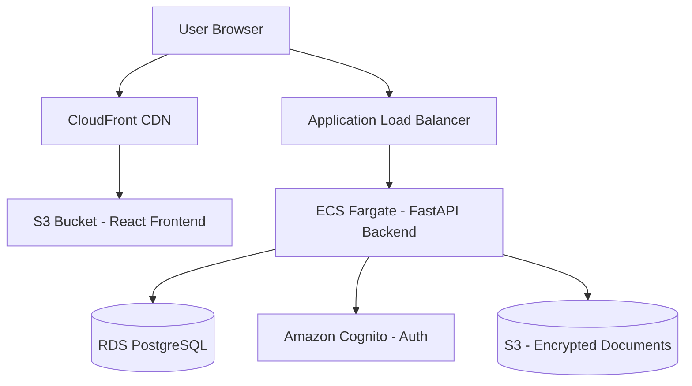
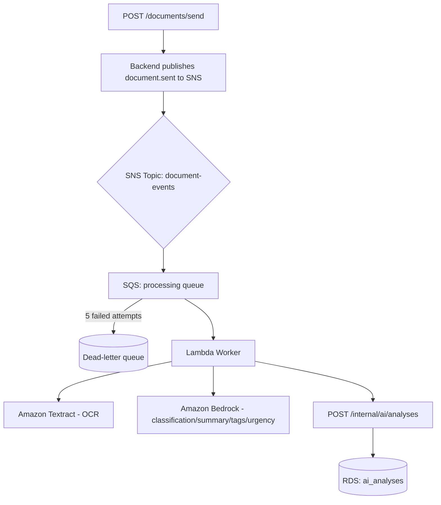

<div align="center">

# 🏥 MediBridge

### Secure, AI-Assisted Clinical Document Exchange

*Replacing the fax machine with a modern, auditable, HIPAA-aware cloud platform*

[](https://aws.amazon.com/)
[](https://fastapi.tiangolo.com/)
[](https://react.dev/)
[](https://www.postgresql.org/)
[](https://www.terraform.io/)
[](#license)

</div>

---

## Table of Contents

- [Overview](#overview)
- [The Problem](#the-problem)
- [Key Features](#key-features)
- [System Architecture](#system-architecture)
- [Tech Stack](#tech-stack)
- [Database Schema](#database-schema)
- [API Reference](#api-reference)
- [Security & Compliance](#security--compliance)
- [Getting Started](#getting-started)
- [Environment Variables](#environment-variables)
- [Project Structure](#project-structure)
- [Testing Strategy](#testing-strategy)
- [Team](#team)
- [Git Workflow](#git-workflow)
- [Important Notice](#important-notice)
- [License](#license)

---

## Overview

**MediBridge** is a secure, cloud-native platform that modernizes clinical document exchange between healthcare organizations. Staff upload a document, it's automatically OCR'd and classified by AI, and it's securely routed to the correct recipient organization — all while maintaining a complete, immutable audit trail.

The platform runs entirely on AWS and was built as a three-week team capstone project, with each engineer owning a vertical slice: frontend, backend API, event-driven AI processing, infrastructure, and database/integration.

## The Problem

A large share of medical communication in the U.S. still happens over fax. Paper-based fax workflows are slow, opaque, and offer little to no visibility into whether a document was actually received. MediBridge addresses this by:

- Replacing manual fax workflows with a secure digital pipeline
- Giving every document a visible, real-time status
- Reducing administrative burden with AI-assisted classification, summarization, and tagging
- Providing centralized, encrypted storage with full audit logging
- Demonstrating a scalable, cloud-native architecture built with HIPAA security principles in mind

## Key Features

| Feature | Description |
|---|---|
| **Authentication & RBAC** | Amazon Cognito–backed sign-in; every user belongs to a healthcare organization and only ever sees data scoped to it |
| **Dashboard** | At-a-glance view of documents sent/received, pending items, AI processing volume, and recent activity |
| **Secure Document Upload & Send** | Files are uploaded directly to encrypted S3 storage via presigned URLs and routed to a recipient organization |
| **AI-Assisted Document Analysis** | Amazon Textract extracts document text; Amazon Bedrock classifies the document, writes a summary, suggests tags, and flags urgency |
| **Inbox with AI Summaries** | Every received document shows its status plus an AI-generated summary and tags for fast triage |
| **AI Analysis Dashboard** | Aggregate stats, category breakdown, and a full history of every AI analysis run |
| **Real-Time Status Tracking** | Documents move through `uploaded → ocr_complete/ocr_failed → classified → routed → delivered` (or `rejected`) |
| **Immutable Audit Trail** | Every send, read, and status change is logged and exportable as CSV |
| **Security Settings** | MFA support, session controls, API keys, and outbound webhooks, all Cognito-backed |
| **Notifications** | In-app notifications with per-user preferences |
| **Task Follow-ups** | AI-recommended follow-up tasks generated from document analysis |

## System Architecture

### Request Flow



### Event-Driven AI Processing Pipeline

When a document is sent, OCR and AI classification run asynchronously so the request to the API returns immediately:



The backend publishes a `document.sent` event carrying only the document ID and S3 key — never document contents — to a single SNS topic. SNS fans out to an SQS queue (with a DLQ for messages that fail five times), a Lambda worker consumes it, runs Textract for OCR and Bedrock for classification, and posts the result back to the backend's internal endpoint, which persists it to `ai_analyses`. Notifications and audit-log entries are written synchronously by the backend itself, not through the async pipeline.

### Cross-Cutting Concerns

All services log to **Amazon CloudWatch**; secrets are stored in **AWS Secrets Manager**; data is encrypted at rest with **AWS KMS**; network access is restricted via **VPC + Security Groups**; and all authentication flows through **Cognito + JWT**.

## Tech Stack

| Layer | Technology |
|---|---|
| **Frontend** | React 18 + TypeScript + Vite, Tailwind CSS, React Router, Axios, AWS Amplify, Recharts |
| **Backend** | FastAPI (Python 3.11), SQLAlchemy 2.0, Alembic migrations, Pydantic v2, python-jose, Docker |
| **Database** | Amazon RDS for PostgreSQL 16 |
| **Storage** | Amazon S3 (documents + static frontend assets) |
| **Auth** | Amazon Cognito, JWT (id token) |
| **Messaging** | Amazon SNS (pub/sub) → Amazon SQS (with a dead-letter queue) |
| **AI / OCR** | Amazon Textract (OCR), Amazon Bedrock (model configurable via `BEDROCK_MODEL_ID`, called through the Converse API) for classification, summarization, tagging, and urgency detection |
| **Compute** | Docker → Amazon ECR → Amazon ECS Fargate (API); AWS Lambda (async AI worker) |
| **Networking** | Amazon VPC, Application Load Balancer, Amazon CloudFront |
| **Security** | AWS KMS, AWS Secrets Manager, IAM least-privilege, Security Groups |
| **Infrastructure as Code** | Terraform, modularized per AWS service (network, kms, s3, secrets, rds, cognito, ecr, alb, ecs, sqs, lambda, frontend-hosting, iam, db-access) |
| **Monitoring** | Amazon CloudWatch (logs, dashboards, alarms — module scaffolded, not yet wired in) |

## Database Schema

The schema is defined as 16 sequential, idempotent SQL migrations in [`database/`](./database), applied in order.

<details>
<summary><strong>Click to expand entity overview</strong></summary>

| Table | Purpose |
|---|---|
| `organizations` | Healthcare organizations using the platform |
| `users` | Individual accounts, linked to an organization and a Cognito identity |
| `documents` | Core document records — sender/recipient org, type, status, S3 location |
| `document_text` | OCR-extracted text per document |
| `routing_events` | History of document routing between organizations |
| `document_access` | Organization-level access grants per document |
| `audit_logs` | Immutable log of every significant system action |
| `notifications` | User-facing alerts (new document, urgent, AI complete, etc.) |
| `ai_analyses` | AI classification results, summaries, tags, confidence scores, and recommendations |
| `tasks` | Follow-up tasks generated from AI recommendations |
| `security_settings` | Per-organization MFA and session policy |
| `user_notification_preferences` | Per-user notification opt-in/opt-out settings |
| `api_keys` | Issued API keys for programmatic access |
| `webhooks` | Outbound webhook subscriptions |

</details>

Core relationships: an `organization` has many `users` and `documents`; a `document` has one `document_text` record and many `routing_events`, `audit_logs`, and `ai_analyses` (enforced one-to-one via a unique constraint on `document_id`); access is enforced per-organization via `document_access`.

## API Reference

All routes are prefixed as shown below and served from the FastAPI app in [`api/`](./api).

| Method | Endpoint | Purpose |
|---|---|---|
| `POST` | `/auth/login` | Authenticate against Cognito and return tokens + user/org context |
| `POST` | `/auth/logout` | Invalidate the current session |
| `GET` | `/auth/me` | Return the current authenticated user |
| `GET` | `/documents/inbox` | List documents received by the user's organization |
| `GET` | `/documents/sent` | List documents sent by the user's organization |
| `GET` | `/documents/search` | Search documents by metadata |
| `GET` | `/documents/{id}` | Retrieve a single document |
| `GET` | `/documents/{id}/download-url` | Generate a presigned S3 download URL |
| `PUT` | `/documents/{id}/read` | Mark a document as read |
| `POST` | `/documents/send` | Route a document to a recipient organization |
| `PUT` | `/documents/{id}/status` | Update a document's status |
| `POST` | `/documents/upload-url` | Generate a presigned S3 upload URL |
| `GET` | `/dashboard/stats` \| `/activity` \| `/document-types` \| `/recent` | Dashboard summary data |
| `GET` | `/audit` | List audit log events |
| `GET` | `/audit/{event_id}` | Retrieve a single audit event |
| `GET` | `/audit/export` | Export the audit trail as CSV |
| `GET` | `/users` | List users in the current organization |
| `PUT` | `/users/{id}/role` | Update a user's role (admin only) |
| `PUT` | `/users/{id}/status` | Activate/deactivate a user (admin only) |
| `GET` | `/organizations` | List organizations |
| `GET` | `/organizations/{id}` | Retrieve a single organization |
| `PUT` | `/organizations/{id}` | Update organization details |
| `GET` | `/notifications` | List notifications for the current user |
| `PUT` | `/notifications/{id}/read` \| `/read-all` | Mark notification(s) as read |
| `DELETE` | `/notifications/{id}` | Delete a notification |
| `GET`/`PUT` | `/settings/notifications` | Get/update notification preferences |
| `GET` | `/ai/stats` \| `/categories` | AI Analysis dashboard aggregates |
| `GET` | `/ai/analyses` | List all AI analyses |
| `GET` | `/ai/analyses/{document_id}` | Retrieve the AI analysis for a document |
| `POST` | `/internal/ai/analyses` | Internal endpoint the AI Lambda posts results to |
| `GET` | `/tasks` | List follow-up tasks |
| `GET` | `/tasks/{id}` | Retrieve a single task |
| `PUT` | `/tasks/{id}/status` | Update a task's status |
| `GET`/`PUT` | `/security/settings` | Get/update organization security settings |
| `GET`/`POST`/`DELETE` | `/settings/api-keys` | Manage API keys |
| `GET`/`POST`/`DELETE` | `/settings/webhooks` | Manage outbound webhooks |
| `GET` | `/health` | Health check |

Interactive OpenAPI docs are available at `/docs` when running against a non-production environment.

## Security & Compliance

MediBridge is designed with HIPAA security principles in mind:

- **Encryption at rest** for RDS, S3, and SQS via AWS KMS
- **Encryption in transit** using HTTPS/TLS for all client–server communication
- **Least-privilege IAM** roles scoped per service
- **Private networking** — RDS runs in private subnets behind a NAT Gateway and is not reachable from the public internet, regardless of security group configuration
- **Security Groups** restrict inbound/outbound traffic to authorized services only
- **Centralized secrets** management via AWS Secrets Manager — no credentials are committed to the repo
- **Cognito-backed authentication** with MFA support
- **Time-limited access** — document downloads use short-lived presigned S3 URLs
- **Immutable audit logging** of every send, status change, and read
- **Role-based, organization-scoped access control** so users only see documents belonging to their own organization

> ⚠️ This project was built for educational/demonstration purposes as part of an ADA DEVELOPERS ACADEMY capstone. It is **not** a HIPAA-compliant system as deployed — production use would additionally require an executed AWS Business Associate Addendum (BAA) and a full compliance review.

## Getting Started

### Prerequisites

- Python 3.11+
- Node.js 18+
- Docker Desktop
- AWS CLI v2, configured with credentials for the team's AWS account
- Terraform >= 1.6 (infrastructure changes only)
- PostgreSQL client (for running migrations locally)

### Backend Setup

```bash
cd api
python -m venv venv && source venv/bin/activate
pip install -r requirements.txt
cp ../.env.example .env         # fill in the values — see Environment Variables below
uvicorn main:app --reload       # start FastAPI on http://localhost:8000
```

Database migrations live in [`database/`](./database) as plain, ordered `.sql` files and are applied with:

```bash
cd database
./run_migrations.sh
```

### Frontend Setup

```bash
cd frontend
npm install
cp .env.example .env.local      # fill in VITE_ vars — see below
npm run dev                     # start Vite dev server on http://localhost:5173
```

### Local Database (Docker)

```bash
docker compose up -d            # Postgres 16 on localhost:5432 (postgres/postgres)
```

### Infrastructure

```bash
cd infrastructure/terraform
cp terraform.tfvars.example terraform.tfvars
terraform init
terraform plan
terraform apply
```

Terraform state is local for now — see [`infrastructure/README.md`](./infrastructure/README.md) before running `apply`.

## Environment Variables

**Backend (`api/.env`)**

```bash
ENVIRONMENT=
AWS_REGION=us-east-2
DATABASE_URL=            # local/dev override; if unset, DB_HOST/DB_PORT/DB_NAME + DB_SECRET_ARN are used
DB_HOST=
DB_PORT=
DB_NAME=
DB_SECRET_ARN=           # Secrets Manager ARN for RDS master credentials
COGNITO_USER_POOL_ID=
COGNITO_CLIENT_ID=
S3_BUCKET_NAME=
EVENTS_TOPIC_ARN=        # SNS topic the backend publishes document.sent to
AI_INTERNAL_API_KEY=     # shared secret validating the Lambda's calls to /internal/ai/analyses
FRONTEND_URL=            # additional allowed CORS origin
```

**Frontend (`frontend/.env.local`)**

```bash
VITE_API_URL=
VITE_COGNITO_USER_POOL_ID=
VITE_COGNITO_CLIENT_ID=
```

**AI Worker (Lambda, set via Terraform)**

```bash
BEDROCK_MODEL_ID=
BACKEND_API_URL=
APP_SECRETS_ARN=         # Secrets Manager ARN holding AI_INTERNAL_API_KEY
```

> 🔒 Never commit `.env`, `.env.local`, `terraform.tfvars`, or credential files to Git.

## Project Structure

```
MediBridge/
├── frontend/            # React + TypeScript + Vite application
│   └── src/
│       ├── api/          # Centralized API client calls
│       ├── components/   # Layout (Sidebar, TopBar) and reusable UI components
│       ├── context/       # AuthContext (Cognito)
│       ├── pages/         # One file per route (Dashboard, Inbox, AI Analysis, etc.)
│       └── types/         # Shared TypeScript types
├── api/                  # FastAPI backend
│   ├── routes/            # One router per resource
│   ├── models/             # SQLAlchemy models
│   ├── schemas/            # Pydantic request/response schemas
│   ├── services/           # Cognito, S3, audit, event-publishing helpers
│   └── dependencies/       # Auth dependencies
├── workers/               # AI Lambda worker (Textract + Bedrock)
│   └── shared/              # Event parsing, Bedrock/Textract clients, backend callback
├── database/               # Ordered SQL migrations + idempotent seed data
├── infrastructure/         # Terraform, modularized per AWS service
├── contracts/               # Shared API contracts and the Postman collection
├── integration-tests/        # End-to-end and API integration tests (pytest)
├── docs/                      # Architecture blueprint and implementation plan
└── README.md
```

## Testing Strategy

Integration and end-to-end tests live in [`integration-tests/`](./integration-tests) and run with `pytest` against a live backend (local Docker Postgres or real RDS via the SSM tunnel):

| File | Covers |
|---|---|
| `test_auth.py` | Login, `/auth/me`, logout, invalid credentials |
| `test_core_endpoints.py` | Smoke tests across all routers with real auth, plus tracked `xfail` cases for known issues |
| `test_document_flow.py` | Full document journey — send → recipient inbox → audit log entry → status update → updated inbox — plus a cross-organization authorization check |
| `test_ai_pipeline_e2e.py` | Placeholder for the true async AI pipeline (SNS → SQS → Lambda → `ai_analyses`) |

Backend unit tests live in [`api/tests/`](./api/tests). Frontend and worker code paths are additionally covered by manual QA against the deployed `dev` environment ahead of each milestone demo.

## Team

| Role | Name | Focus Area |
|---|---|---|
| Frontend Lead | Vida | React UI, Cognito integration, S3 upload UX, dashboard/inbox/AI/audit/security pages |
| Backend API Lead | Bella | FastAPI services, auth middleware, document/user/org endpoints, ECS deployment |
| Event-Driven & AI Lead | Ayesha | SNS/SQS pipeline, Lambda worker, Textract + Bedrock integration |
| Infrastructure & Security Lead | Olga | VPC, ALB, Cognito, KMS, IAM, Terraform, monitoring |
| Database & Integration Lead | Raissa | Schema design and migrations, seed data, cross-service integration testing, documentation |


## Important Notice

MediBridge is an educational capstone prototype. It must not be used to process real Protected Health Information (PHI).

## License

This project was developed as part of a capstone program. License terms are to be determined by the team before the repository is made public.

---

<div align="center">

Built with care by the MediBridge team — modernizing how healthcare organizations exchange documents, one upload at a time.

</div>
